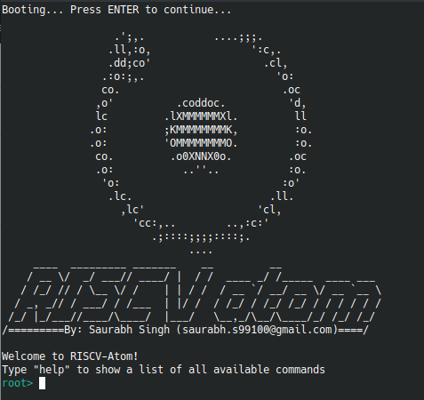

# atomshell
A basic shell program for embedded processors.


## Getting Started

**Setup RISC-V Atom**

First, we need to clone and setup the [RISC-V Atom](https://github.com/saurabhsingh99100/riscv-atom) repository. 


**Clone atomshell**

Open terminal (say, terminal-1) and run following command
```bash
$ git clone https://github.com/saurabhsingh99100/atomshell.git
```


**Build Atomshell**

```bash
$ cd atomshell
$ make Target=hydrogensoc
```


**Run Atomshell**

Open another terminal (say, terminal-2) and run the following command to generate virtual ports: `simport` & `userport`.
```bash
$ atomsim-gen-vports
```

Now, connect to generated virtual port: `userport`.
```bash
$ screen $RVATOM/userport 9600
```

Now in terminal-1, run atomshell in AtomSim using the following command
```bash
$ make run
```

Now, switch back to terminal-2 and you should see AtomSim booting atomshell. Press `enter` to continue with the boot. You should see the atomshell prompt.

To see all the supported commands run the `help` command